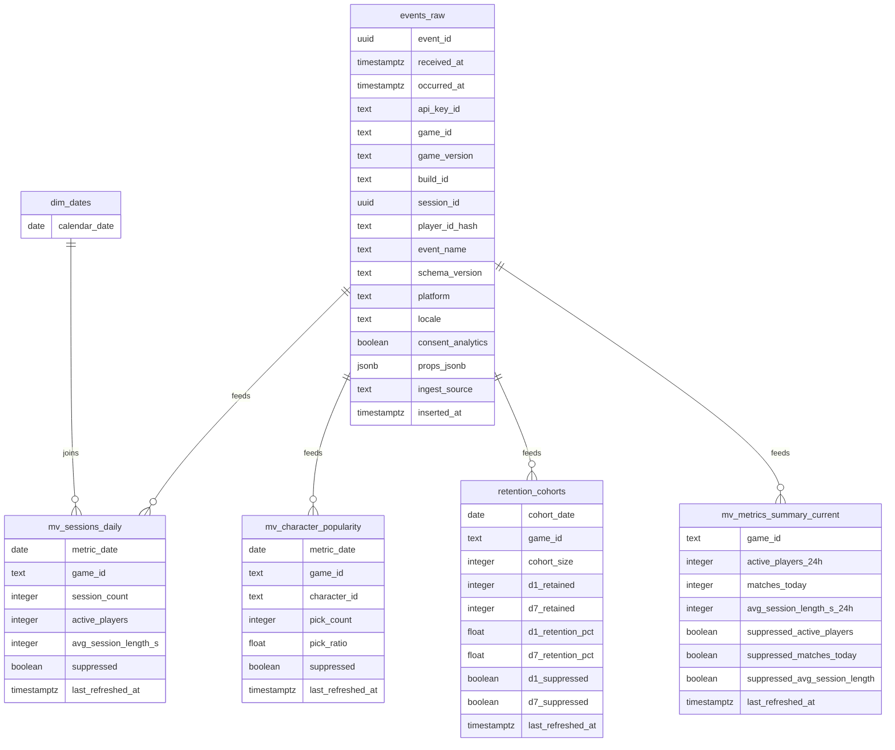

# ERD

## Notes
- Phase 3 includes the initial Prisma schema and migration for `events_raw`.
- Phase 4 adds Prisma-managed `dim_dates` and `retention_cohorts`, plus SQL-managed materialized views for sessions, character popularity, and current KPI summary.
- `events_raw` remains append-only with 90-day retention.
- MVP ingest persists `ingest_source = 'godot_sdk'` for accepted SDK batches.
- `apps/warehouse-worker` owns the local refresh and demo-seed workflow through `refresh:rolling`, `refresh:retention`, `refresh:all`, and `seed:demo`.
- Sessions and KPI summary refresh from rolling commands; retention cohorts rebuild via a separate retention command.
- Zero-fill is performed through `dim_dates` joins for daily sessions; suppressed buckets are flagged in the derived structures themselves.
- Additional dimensions (characters metadata, etc.) can be linked later.
