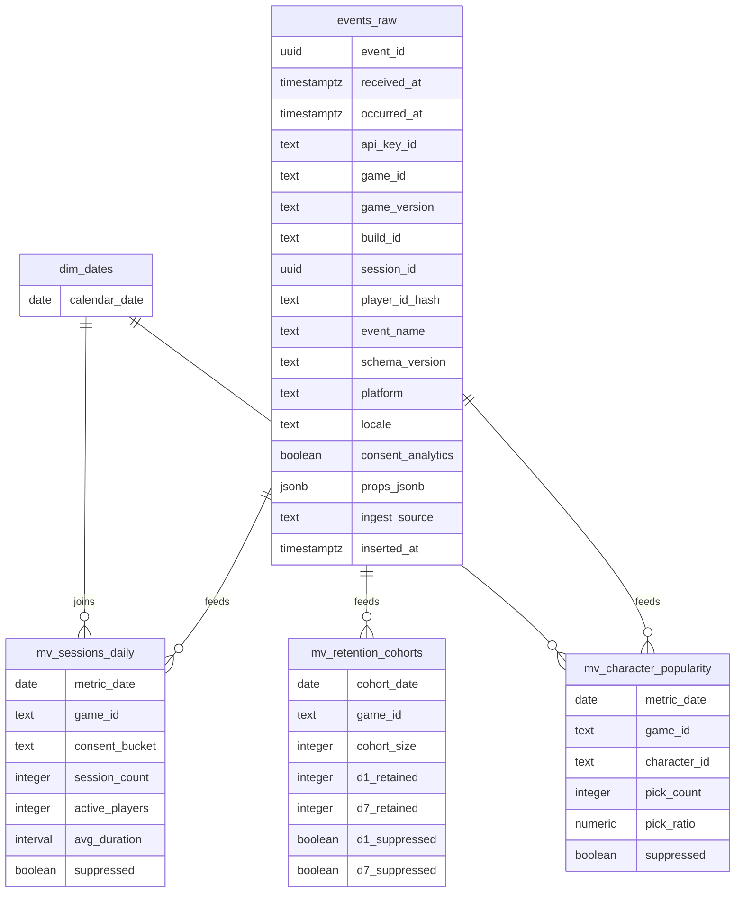

# ERD

## Notes
- Phase 3 includes the initial Prisma schema and migration for `events_raw`.
- `events_raw` remains append-only with 90-day retention.
- MVP ingest persists `ingest_source = 'godot_sdk'` for accepted SDK batches.
- Materialized views refresh every 5 minutes (sessions/popularity) or nightly (retention).
- Zero-fill performed via `dim_dates` joins; suppressed buckets flagged in derived views.
- Additional dimensions (characters metadata, etc.) can be linked later.
