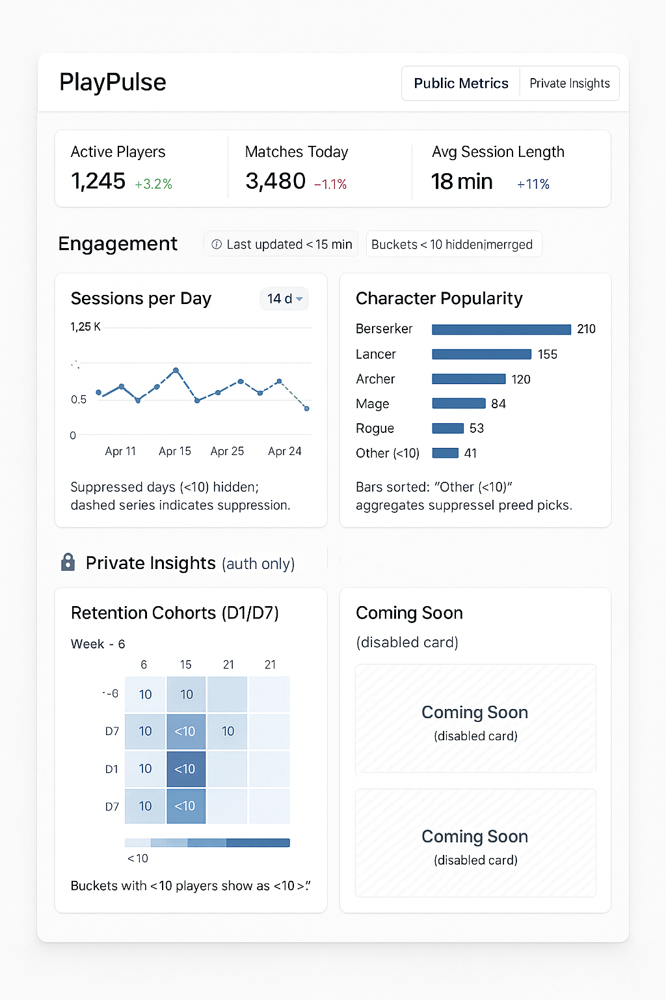

# RFC-006 — Dashboard IA & Initial K-Anonymized Charts

**Status**: Draft for review  
**Owners**: Product Designer, Tech Lead  
**Reviewers**: Frontend Lead, Analytics Lead, Privacy Officer

## Context & Goals
- Define day-one information architecture for the PlayPulse dashboard (public + private views).  
- Specify initial charts (sessions/day, character popularity, retention) and how k-anonymity affects their UX.  
- Provide a reference mock/wireframe to guide component implementation.

## Information Architecture
### Global Layout
- Top navigation with PlayPulse logo (left) and tabs (right): `Public Metrics` (default) and `Private Insights` (auth only).  
- Auth controls: unauthenticated users see `Sign in for private insights`; authenticated users see avatar + status chip.

### Public Metrics Page
1. **KPI Strip**: three stat cards for `Active Players`, `Matches Today`, `Avg Session Length`.  
2. **Chart Grid**: two-card grid (Desktop 2-col, mobile stacked).  
   - `Sessions per Day` (line chart)  
   - `Character Popularity` (horizontal bar chart)  
3. **Footer Note**: privacy disclaimer (“Data refreshed <15 min. Buckets <10 merged or hidden.”).

### Private Insights Page (auth required)
1. `Retention Cohorts (D1/D7)` chart card (heatmap/stacked bars).  
2. Two `Coming Soon` cards (disabled) to telegraph roadmap.  
3. Shared footer note on freshness + k-anonymity.

### Card Layout & States
- **Header**: Title + info tooltip, optional range toggle (7d/14d/30d).  
- **Body**: Chart region with four states: loading skeleton, chart, empty (if >50% suppressed), error (message + retry).  
- **Footer**: `Last updated` timestamp + k-anonymity message.  
- Loading skeleton: shimmering rects for title & chart.  
- Error state: inline alert with `request_id` snippet + “Retry” button.  
- Empty state: illustration + “Not enough anonymized data yet. Try widening the date range.”

## Initial Charts
### Sessions per Day (Public)
- Line chart showing last 14 days of session counts.  
- Suppressed points (<10 unique players) render as dashed markers with tooltip “Hidden to protect player privacy.”  
- Tooltip: date + session count (or `Hidden`).  
- Range toggle (7d/14d) optional.

### Character Popularity (Public)
- Horizontal bar chart (top characters by pick rate over last 7 days).  
- Bars sorted descending; suppressed categories merged into `Other (<10 players)`.  
- Tooltip shows character, pick %, raw selections when ≥10.  
- If all categories suppressed → empty state.

### Retention Cohorts (Private)
- Heatmap/stacked bars showing D1/D7 retention percentages by cohort (signup week).  
- Tooltip displays `D1 45% / <10 players` when counts <10.  
- Toggle to switch between MythClash/MythTag or combined view.  
- Table view (optional) showing percentages; raw counts shown only when ≥10.

## K-Anonymity UX Rules
- Backend marks suppressed buckets (`suppressed: true`).  
- Front end behavior:  
  - **Categorical charts**: combine suppressed buckets into `Other (<10 players)`; hide detailed tooltip.  
  - **Time-series**: replace value with dashed marker + tooltip “Hidden to protect player privacy.”  
  - **Retention**: show `<10` badge instead of raw count; percentages still display.  
  - If more than 50% of data points suppressed, show empty state.  
- Footer note on every card clarifies anonymization (“Buckets with fewer than 10 players are merged or hidden.”).

## Component Map / Wireframe
```
Layout
└── TopNav
    ├── Logo
    ├── NavTabs [Public Metrics | Private Insights]
    └── AuthControls

PublicMetricsPage
└── Container (max width 1200px)
    ├── KPIGrid (StatCard x3)
    ├── ChartGrid (2 columns desktop)
    │   ├── ChartCard id="sessions-per-day"
    │   └── ChartCard id="character-popularity"
    └── FooterNote (privacy disclaimer)

PrivateInsightsPage
└── Container
    ├── ChartCard id="retention-cohorts"
    └── ComingSoonCard x2

ChartCard
└── Header (Title, InfoTooltip, RangeToggle)
└── Body (Skeleton | Chart | EmptyState | ErrorState)
└── Footer (LastUpdated + KAnon message)
```

## Visual Reference
  
Lo-fi mock illustrating card layout, chart organization, and k-anonymity messaging.

## Open Questions
1. Should public KPIs show 7-day averages vs raw daily values?  
2. Do we need a public data freshness badge (e.g., “Live demo data updated 5 min ago”)?  
3. How will we badge characters with suppressed data in tooltips (icon vs text)?

## Decision
Adopt the above information architecture, initial charts, and k-anonymity UX as the baseline for the dashboard MVP.
